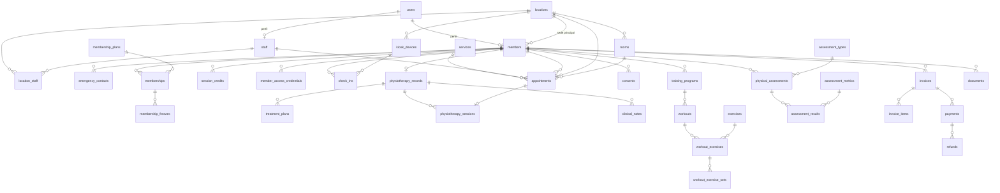

# PROFITLIFE — ERD detallado (Fase 1)

Estado: **propuesta para aprobación**. Ninguna migración se escribe hasta aprobar este documento.
Motor: MySQL 8 (InnoDB, `utf8mb4_unicode_ci`). Framework: Laravel, PHP 8.3+.

## 1. Convenciones

| Tema | Regla |
|---|---|
| Claves primarias | `id` `BIGINT UNSIGNED AUTO_INCREMENT` en todas las tablas, salvo `notifications` (UUID, estándar de Laravel). |
| Claves foráneas | `BIGINT UNSIGNED`, siempre con restricción real en la base de datos. Por defecto `ON DELETE RESTRICT`; las excepciones se indican (`CASCADE`, `SET NULL`). |
| Fechas | `DATETIME` en UTC; se muestran en `America/Bogota`. Las fechas sin hora (vigencias, nacimiento) son `DATE`. |
| Dinero | `BIGINT` en **centavos** (`*_cents`) más `currency CHAR(3)` (`COP`). Así coincide con las pasarelas colombianas, que reciben el monto en centavos. $150.000 se guarda como `15000000`. |
| Impuestos | `tax_rate_bps SMALLINT` en puntos básicos (19 % = `1900`). |
| Estados y tipos | `VARCHAR(30)` respaldado por un Enum de PHP. No se usa `ENUM` de MySQL, porque añadir un valor obliga a alterar la tabla. |
| Borrado | `deleted_at` (soft delete) en las entidades de negocio. Las tablas clínicas firmadas, de historial y de auditoría no se borran ni se editan. |
| Cifrado | Las columnas marcadas **[cifrado]** usan el cast `encrypted` de Laravel. Son `TEXT`/`LONGTEXT` y no se pueden buscar ni indexar. |
| Auditoría | `created_by` apunta a `users.id` y es nulo cuando la acción la hace el sistema. |
| `ts` | Abreviatura de `created_at` + `updated_at`. `sd` es `deleted_at`. |

## 2. Diagrama conceptual



## 3. Identidad y acceso

```
users                                   -- solo autenticación; sin datos de negocio
  id
  name                      VARCHAR(150)
  email                     VARCHAR(190)  UNIQUE
  email_verified_at         DATETIME NULL
  password                  VARCHAR(255) NULL     -- nulo hasta aceptar la invitación
  two_factor_secret         TEXT NULL  [cifrado]  -- Fortify
  two_factor_recovery_codes TEXT NULL  [cifrado]
  two_factor_confirmed_at   DATETIME NULL
  is_active                 BOOLEAN default true
  locale                    VARCHAR(5) default 'es_CO'
  last_login_at             DATETIME NULL
  last_login_ip             VARCHAR(45) NULL
  remember_token, ts, sd

staff
  id
  user_id               FK users  UNIQUE
  first_name, last_name VARCHAR(100)
  document_type         VARCHAR(10) NULL      -- CC, CE, PA...
  document_number       VARCHAR(30) NULL
  phone                 VARCHAR(20) NULL
  job_title             VARCHAR(100) NULL
  professional_license  VARCHAR(50) NULL      -- tarjeta profesional (fisioterapia)
  photo_path            VARCHAR(255) NULL
  calendar_color        CHAR(7) NULL
  is_bookable           BOOLEAN default false -- aparece como profesional en citas
  status                VARCHAR(30)           -- active | inactive
  hired_on              DATE NULL
  ts, sd

location_staff                          -- sedes de cada empleado = su alcance
  id
  location_id   FK locations
  staff_id      FK staff  CASCADE
  is_primary    BOOLEAN default false
  ts
  UNIQUE (location_id, staff_id)

members
  id
  user_id           FK users NULL UNIQUE  SET NULL  -- nulo = sin cuenta de portal
  member_number     VARCHAR(20) UNIQUE              -- ID visible, p. ej. PL-000123
  home_location_id  FK locations
  first_name, last_name VARCHAR(100)
  document_type     VARCHAR(10) NULL                -- CC, TI, CE, PA
  document_number   VARCHAR(30) NULL
  birth_date        DATE NULL
  gender            VARCHAR(20) NULL
  email             VARCHAR(190) NULL
  phone             VARCHAR(20) NULL
  address_line      VARCHAR(255) NULL
  city, department  VARCHAR(100) NULL
  photo_path        VARCHAR(255) NULL
  status            VARCHAR(30)                     -- active | inactive | blocked
  joined_on         DATE
  created_by        FK users NULL
  ts, sd
  UNIQUE (document_type, document_number)
  INDEX (home_location_id, status), INDEX (phone), INDEX (email)
  INDEX (last_name, first_name)

emergency_contacts
  id
  member_id     FK members CASCADE
  name          VARCHAR(150)
  relationship  VARCHAR(50) NULL
  phone         VARCHAR(20)
  alt_phone     VARCHAR(20) NULL
  email         VARCHAR(190) NULL
  is_primary    BOOLEAN default false
  ts

member_notes                            -- notas administrativas, nunca clínicas
  id
  member_id   FK members CASCADE
  author_id   FK users
  body        TEXT
  is_pinned   BOOLEAN default false
  ts, sd
```

Tablas estándar que no se rediseñan: `roles`, `permissions`, `model_has_roles`, `model_has_permissions`, `role_has_permissions` (Spatie); `personal_access_tokens` (Sanctum); `password_reset_tokens`, `sessions`, `jobs`, `job_batches`, `failed_jobs`, `cache` (Laravel).

El email del cliente no es único en `members` porque un acudiente puede compartirlo con un menor; sí lo es en `users`.

## 4. Sedes

```
locations
  id
  name          VARCHAR(120)
  slug          VARCHAR(120) UNIQUE
  code          VARCHAR(10)  UNIQUE          -- prefijo corto para reportes
  address_line  VARCHAR(255)
  city, department VARCHAR(100)
  phone         VARCHAR(20) NULL
  email         VARCHAR(190) NULL
  timezone      VARCHAR(50) default 'America/Bogota'
  is_active     BOOLEAN default true
  ts, sd

location_hours                          -- varias filas por día permiten jornada partida
  id
  location_id   FK locations CASCADE
  day_of_week   TINYINT                      -- 1 = lunes ... 7 = domingo
  opens_at, closes_at  TIME
  INDEX (location_id, day_of_week)

location_closures                       -- festivos y cierres puntuales
  id
  location_id   FK locations NULL CASCADE    -- nulo = todas las sedes
  closed_on     DATE
  reason        VARCHAR(150) NULL
  ts
  INDEX (closed_on)

rooms
  id
  location_id   FK locations
  name          VARCHAR(100)
  type          VARCHAR(30) NULL             -- consultorio, sala, zona
  capacity      SMALLINT default 1
  is_active     BOOLEAN default true
  ts, sd

location_service                        -- servicios disponibles por sede
  location_id   FK locations CASCADE
  service_id    FK services  CASCADE
  price_cents   BIGINT NULL                  -- precio propio de la sede; nulo = el del servicio
  is_active     BOOLEAN default true
  PRIMARY KEY (location_id, service_id)
```

## 5. Membresías

```
membership_plans
  id
  name                  VARCHAR(120)
  slug                  VARCHAR(120) UNIQUE
  description           TEXT NULL
  duration_unit         VARCHAR(10) NULL     -- day | week | month | year; nulo = indefinida
  duration_count        SMALLINT NULL
  billing_unit          VARCHAR(10)          -- frecuencia de cobro
  billing_count         SMALLINT
  price_cents           BIGINT
  enrollment_fee_cents  BIGINT default 0
  currency              CHAR(3)
  tax_rate_bps          SMALLINT default 0
  access_scope          VARCHAR(30)          -- all_locations | selected_locations
  visit_limit_count     SMALLINT NULL        -- nulo = visitas ilimitadas
  visit_limit_period    VARCHAR(10) NULL     -- week | month | term
  max_freeze_days       SMALLINT NULL
  auto_renews           BOOLEAN default false
  benefits              JSON NULL            -- lista de textos para mostrar, no se consulta
  is_active             BOOLEAN default true
  sort_order            SMALLINT default 0
  ts, sd

location_membership_plan                -- sedes donde el plan es válido
  membership_plan_id  FK CASCADE
  location_id         FK CASCADE
  PRIMARY KEY (membership_plan_id, location_id)

membership_plan_service                 -- sesiones incluidas en el plan
  id
  membership_plan_id  FK CASCADE
  service_id          FK services
  sessions_included   SMALLINT NULL        -- nulo = ilimitadas
  period              VARCHAR(20)          -- per_billing_period | per_term
  UNIQUE (membership_plan_id, service_id)

memberships
  id
  member_id             FK members
  membership_plan_id    FK membership_plans
  purchase_location_id  FK locations
  status                VARCHAR(30)   -- pending | active | frozen | suspended | expired | cancelled
  starts_on             DATE
  ends_on               DATE NULL
  next_billing_on       DATE NULL
  price_cents           BIGINT        -- copia del precio al contratar
  currency              CHAR(3)
  auto_renews           BOOLEAN
  renewed_from_id       FK memberships NULL
  cancelled_at          DATETIME NULL
  cancellation_reason   VARCHAR(255) NULL
  notes                 TEXT NULL
  created_by            FK users NULL
  ts, sd
  INDEX (member_id, status), INDEX (status, ends_on), INDEX (next_billing_on)

membership_freezes
  id
  membership_id FK memberships CASCADE
  starts_on     DATE
  ends_on       DATE NULL             -- nulo = congelación abierta
  reason        VARCHAR(255) NULL
  created_by    FK users NULL
  ts

membership_status_histories             -- solo inserción
  id
  membership_id FK memberships CASCADE
  from_status   VARCHAR(30) NULL
  to_status     VARCHAR(30)
  reason        VARCHAR(255) NULL
  changed_by    FK users NULL         -- nulo = cambio automático (job)
  created_at

session_credits                         -- libro mayor; saldo = SUM(delta)
  id
  member_id       FK members
  membership_id   FK memberships NULL
  service_id      FK services
  delta           SMALLINT             -- +N al otorgar, -1 al consumir
  reason          VARCHAR(30)          -- grant | consume | expire | adjust | refund
  appointment_id  FK appointments NULL
  expires_on      DATE NULL
  created_by      FK users NULL
  created_at
  INDEX (member_id, service_id)
```

El precio se copia a `memberships` para que un cambio de tarifa del plan no altere contratos vigentes.

## 6. Check-in

```
kiosk_devices                           -- se autentica con un token Sanctum propio
  id
  location_id   FK locations
  name          VARCHAR(100)
  is_active     BOOLEAN default true
  last_seen_at  DATETIME NULL
  last_ip       VARCHAR(45) NULL
  ts, sd

member_access_credentials
  id
  member_id       FK members CASCADE
  type            VARCHAR(30)          -- qr | membership_code
  token_hash      CHAR(64) UNIQUE      -- SHA-256; es lo que se busca al escanear
  token_encrypted TEXT [cifrado]       -- permite volver a mostrar el QR en el portal
  is_active       BOOLEAN default true
  expires_at      DATETIME NULL
  last_used_at    DATETIME NULL
  ts
  INDEX (member_id, type, is_active)

check_ins                               -- solo inserción; registra aceptados y rechazados
  id
  member_id         FK members NULL    -- nulo = intento sin identificar
  location_id       FK locations
  membership_id     FK memberships NULL
  kiosk_device_id   FK kiosk_devices NULL
  registered_by     FK users NULL      -- check-in manual en recepción
  method            VARCHAR(30)        -- qr | phone | member_number | membership_code | manual
  result            VARCHAR(30)        -- accepted | rejected
  rejection_reason  VARCHAR(40) NULL   -- membership_expired | membership_suspended |
                                       -- membership_frozen | member_inactive |
                                       -- location_not_allowed | visit_limit_reached |
                                       -- duplicate | not_found
  checked_in_at     DATETIME
  created_at
  INDEX (location_id, checked_in_at), INDEX (member_id, checked_in_at)
```

## 7. Servicios y citas

```
services
  id
  name                VARCHAR(120)
  slug                VARCHAR(120) UNIQUE
  category            VARCHAR(30)      -- physiotherapy | personal_training | assessment | other
  description         TEXT NULL
  duration_minutes    SMALLINT
  buffer_minutes      SMALLINT default 0   -- margen entre citas
  price_cents         BIGINT
  currency            CHAR(3)
  tax_rate_bps        SMALLINT default 0
  requires_room       BOOLEAN default false
  is_clinical         BOOLEAN default false  -- activa las reglas de privacidad
  is_bookable_online  BOOLEAN default false
  color               CHAR(7) NULL
  is_active           BOOLEAN default true
  ts, sd

service_staff                           -- quién puede prestar cada servicio
  service_id  FK CASCADE
  staff_id    FK CASCADE
  PRIMARY KEY (service_id, staff_id)

staff_schedules                         -- disponibilidad semanal por sede
  id
  staff_id      FK staff CASCADE
  location_id   FK locations
  day_of_week   TINYINT
  starts_at, ends_at  TIME
  valid_from    DATE NULL
  valid_until   DATE NULL
  ts
  INDEX (staff_id, day_of_week)

staff_time_off
  id
  staff_id    FK staff CASCADE
  starts_at, ends_at  DATETIME
  reason      VARCHAR(150) NULL
  created_by  FK users NULL
  ts
  INDEX (staff_id, starts_at)

appointments
  id
  member_id             FK members
  staff_id              FK staff
  service_id            FK services
  location_id           FK locations
  room_id               FK rooms NULL
  starts_at, ends_at    DATETIME
  status                VARCHAR(30)  -- pending | confirmed | completed | cancelled | no_show | rescheduled
  source                VARCHAR(20)  -- admin | portal
  notes                 TEXT NULL    -- administrativas; el contenido clínico va en otro módulo
  price_cents           BIGINT NULL  -- copia del precio al reservar
  rescheduled_from_id   FK appointments NULL
  cancelled_at          DATETIME NULL
  cancelled_by          FK users NULL
  cancellation_reason   VARCHAR(255) NULL
  created_by            FK users NULL
  ts, sd
  INDEX (staff_id, starts_at, ends_at)
  INDEX (room_id, starts_at, ends_at)
  INDEX (location_id, starts_at)
  INDEX (member_id, starts_at)
  INDEX (status)

appointment_status_histories            -- solo inserción
  id
  appointment_id  FK appointments CASCADE
  from_status     VARCHAR(30) NULL
  to_status       VARCHAR(30)
  reason          VARCHAR(255) NULL
  changed_by      FK users NULL
  created_at
```

**Doble booking en MySQL.** `BookAppointmentAction` abre una transacción, bloquea la fila del profesional (y la de la sala, si hay) con `SELECT … FOR UPDATE`, comprueba que no exista otra cita activa que se solape (`starts_at < :fin AND ends_at > :inicio`, estados `pending` o `confirmed`) y solo entonces inserta. El bloqueo sobre la fila del profesional serializa las reservas simultáneas; los índices `(staff_id, starts_at, ends_at)` y `(room_id, …)` hacen barata la comprobación.

## 8. Fisioterapia (datos clínicos)

Todas las tablas de esta sección tienen Policy propia y cada lectura queda en `clinical_access_logs`.

```
physiotherapy_records                   -- un expediente por cliente
  id
  member_id               FK members UNIQUE
  primary_staff_id        FK staff NULL
  status                  VARCHAR(30)          -- active | discharged
  reason_for_consultation TEXT NULL [cifrado]
  medical_history         LONGTEXT NULL [cifrado]
  medications             TEXT NULL [cifrado]
  allergies               TEXT NULL [cifrado]
  opened_at               DATETIME
  opened_by               FK users
  ts

physiotherapy_record_staff              -- equipo tratante: define "sus pacientes"
  id
  physiotherapy_record_id FK CASCADE
  staff_id                FK staff
  granted_by              FK users
  granted_at              DATETIME
  revoked_at              DATETIME NULL
  UNIQUE (physiotherapy_record_id, staff_id)

treatment_plans
  id
  physiotherapy_record_id FK
  staff_id                FK staff
  title                   VARCHAR(150)
  diagnosis               TEXT NULL [cifrado]
  goals                   TEXT NULL [cifrado]
  planned_sessions        SMALLINT NULL
  starts_on               DATE
  ends_on                 DATE NULL
  status                  VARCHAR(30)   -- draft | active | completed | cancelled
  is_visible_to_member    BOOLEAN default false
  ts, sd

physiotherapy_sessions
  id
  physiotherapy_record_id FK
  treatment_plan_id       FK NULL
  appointment_id          FK appointments NULL UNIQUE
  staff_id                FK staff
  location_id             FK locations
  session_type            VARCHAR(30)   -- initial_evaluation | treatment | follow_up | discharge
  performed_at            DATETIME
  pain_scale              TINYINT NULL  -- 0 a 10
  summary_for_member      TEXT NULL     -- lo único que ve el cliente en el portal
  ts
  INDEX (physiotherapy_record_id, performed_at)

clinical_notes                          -- sin soft delete; inmutable al firmarse
  id
  physiotherapy_record_id   FK
  physiotherapy_session_id  FK NULL
  author_id                 FK staff
  type                      VARCHAR(30) -- evaluation | progress | soap | addendum
  parent_note_id            FK clinical_notes NULL   -- una adenda corrige a su nota
  body                      LONGTEXT [cifrado]
  signed_at                 DATETIME NULL
  signed_by                 FK staff NULL
  is_visible_to_member      BOOLEAN default false
  ts
  INDEX (physiotherapy_record_id, created_at)

consent_templates
  id
  type        VARCHAR(30)   -- data_processing | clinical_treatment | image_use | liability
  title       VARCHAR(150)
  body        LONGTEXT
  version     SMALLINT
  is_active   BOOLEAN default true
  ts
  UNIQUE (type, version)

consents                                -- sirve a todos los módulos, no solo fisioterapia
  id
  member_id             FK members
  consent_template_id   FK consent_templates
  method                VARCHAR(20)   -- digital | paper
  signed_name           VARCHAR(150)  -- el cliente o su acudiente
  document_id           FK documents NULL   -- PDF o escaneo firmado
  accepted_at           DATETIME
  revoked_at            DATETIME NULL
  ip_address            VARCHAR(45) NULL
  captured_by           FK users NULL
  ts
  INDEX (member_id, consent_template_id)

clinical_access_logs                    -- solo inserción
  id
  user_id       FK users
  member_id     FK members
  subject_type  VARCHAR(100)
  subject_id    BIGINT
  action        VARCHAR(20)   -- view | create | update | sign | download | export
  ip_address    VARCHAR(45) NULL
  user_agent    VARCHAR(255) NULL
  created_at
  INDEX (member_id, created_at), INDEX (user_id, created_at)
```

Los ejercicios que prescribe el fisioterapeuta no tienen tabla propia: son un `training_program` de tipo `rehab` enlazado al plan de tratamiento. Así se reutiliza la biblioteca de ejercicios y la vista del portal.

## 9. Entrenamiento

```
muscle_groups   id, name VARCHAR(80), slug UNIQUE
equipment       id, name VARCHAR(80), slug UNIQUE

exercises
  id
  name          VARCHAR(150)
  slug          VARCHAR(150) UNIQUE
  description   TEXT NULL
  instructions  TEXT NULL
  video_url     VARCHAR(255) NULL
  image_path    VARCHAR(255) NULL
  is_active     BOOLEAN default true
  created_by    FK users NULL
  ts, sd

exercise_muscle_group   exercise_id FK, muscle_group_id FK, is_primary BOOLEAN   PK compuesta
equipment_exercise      exercise_id FK, equipment_id FK                          PK compuesta

training_programs
  id
  member_id           FK members
  staff_id            FK staff
  treatment_plan_id   FK treatment_plans NULL
  type                VARCHAR(20)   -- training | rehab
  name                VARCHAR(150)
  goal                TEXT NULL
  starts_on           DATE NULL
  ends_on             DATE NULL
  status              VARCHAR(30)   -- draft | active | completed | archived
  ts, sd
  INDEX (member_id, status)

workouts                                -- una rutina o sesión del programa
  id
  training_program_id FK CASCADE
  name                VARCHAR(150)
  scheduled_on        DATE NULL
  sort_order          SMALLINT default 0
  notes               TEXT NULL
  ts

workout_exercises
  id
  workout_id      FK workouts CASCADE
  exercise_id     FK exercises
  sort_order      SMALLINT default 0
  superset_group  TINYINT NULL
  notes           TEXT NULL

workout_exercise_sets                   -- lo prescrito
  id
  workout_exercise_id FK CASCADE
  set_number          TINYINT
  reps                SMALLINT NULL
  weight_kg           DECIMAL(6,2) NULL
  duration_seconds    SMALLINT NULL
  distance_meters     INT NULL
  rest_seconds        SMALLINT NULL
  rpe                 DECIMAL(3,1) NULL
  notes               VARCHAR(255) NULL

workout_logs                            -- lo realizado
  id
  workout_id        FK workouts
  member_id         FK members
  logged_by         FK users
  performed_at      DATETIME
  duration_minutes  SMALLINT NULL
  rpe               DECIMAL(3,1) NULL
  notes             TEXT NULL
  ts
  INDEX (member_id, performed_at)

workout_log_sets
  id
  workout_log_id      FK CASCADE
  workout_exercise_id FK workout_exercises
  set_number          TINYINT
  reps, weight_kg, duration_seconds, distance_meters, rpe   -- mismos tipos que lo prescrito
```

## 10. Evaluaciones físicas

```
assessment_types                        -- p. ej. "Composición corporal", "Test de fuerza"
  id
  name        VARCHAR(120)
  slug        VARCHAR(120) UNIQUE
  category    VARCHAR(30)   -- training | physiotherapy
  description TEXT NULL
  is_active   BOOLEAN default true
  ts, sd

assessment_metrics                      -- PROFITLIFE define sus propias métricas
  id
  name              VARCHAR(120)
  key               VARCHAR(80) UNIQUE
  unit              VARCHAR(20) NULL     -- kg, cm, %, s
  value_type        VARCHAR(20)          -- number | text | boolean | select
  options           JSON NULL            -- opciones cuando value_type = select
  min_value, max_value  DECIMAL(12,4) NULL
  higher_is_better  BOOLEAN NULL         -- orienta el color de la gráfica
  is_active         BOOLEAN default true
  ts

assessment_type_metric
  assessment_type_id    FK CASCADE
  assessment_metric_id  FK CASCADE
  sort_order            SMALLINT default 0
  is_required           BOOLEAN default false
  PRIMARY KEY (assessment_type_id, assessment_metric_id)

physical_assessments
  id
  member_id           FK members
  assessment_type_id  FK assessment_types
  staff_id            FK staff
  location_id         FK locations
  appointment_id      FK appointments NULL
  performed_at        DATETIME
  notes               TEXT NULL
  is_clinical         BOOLEAN default false  -- las clínicas siguen las reglas de la sección 8
  is_visible_to_member BOOLEAN default true
  ts, sd
  INDEX (member_id, performed_at)

assessment_results                      -- una fila por métrica
  id
  physical_assessment_id  FK CASCADE
  assessment_metric_id    FK assessment_metrics
  value_number            DECIMAL(12,4) NULL
  value_text              VARCHAR(255) NULL
  UNIQUE (physical_assessment_id, assessment_metric_id)
  INDEX (assessment_metric_id)
```

## 11. Pagos

```
invoices
  id
  number          VARCHAR(30) NULL UNIQUE   -- se asigna al emitir
  member_id       FK members
  location_id     FK locations
  status          VARCHAR(30)   -- draft | issued | partially_paid | paid | void
  issued_at       DATETIME NULL
  due_on          DATE NULL
  subtotal_cents, discount_cents, tax_cents, total_cents, paid_cents   BIGINT
  currency        CHAR(3)
  notes           TEXT NULL
  created_by      FK users NULL
  ts, sd
  INDEX (member_id, status), INDEX (location_id, issued_at)

invoice_items
  id
  invoice_id        FK invoices CASCADE
  billable_type     VARCHAR(100) NULL   -- membership | appointment | service ...
  billable_id       BIGINT NULL
  description       VARCHAR(255)
  quantity          SMALLINT default 1
  unit_price_cents  BIGINT
  discount_cents    BIGINT default 0
  tax_rate_bps      SMALLINT default 0
  tax_cents         BIGINT
  total_cents       BIGINT
  INDEX (billable_type, billable_id)

payments
  id
  invoice_id              FK invoices
  member_id               FK members
  location_id             FK locations
  amount_cents            BIGINT
  currency                CHAR(3)
  method                  VARCHAR(30)  -- cash | card_terminal | transfer | nequi | pse | gateway
  status                  VARCHAR(30)  -- pending | paid | failed | refunded | cancelled
  gateway                 VARCHAR(30) NULL
  external_transaction_id VARCHAR(120) NULL
  reference               VARCHAR(100) NULL   -- n.º de comprobante o voucher
  payment_method_id       FK payment_methods NULL
  paid_at                 DATETIME NULL
  received_by             FK users NULL
  meta                    JSON NULL           -- respuesta de la pasarela
  ts
  UNIQUE (gateway, external_transaction_id)
  INDEX (member_id, paid_at), INDEX (location_id, paid_at), INDEX (status)

refunds
  id
  payment_id          FK payments
  amount_cents        BIGINT
  reason              VARCHAR(255) NULL
  status              VARCHAR(30)   -- pending | completed | failed
  external_refund_id  VARCHAR(120) NULL
  processed_by        FK users NULL
  processed_at        DATETIME NULL
  ts

payment_methods                         -- Fase 10; solo el token de la pasarela, nunca la tarjeta
  id
  member_id       FK members
  gateway         VARCHAR(30)
  external_token  VARCHAR(255)
  brand           VARCHAR(30) NULL
  last_four       CHAR(4) NULL
  exp_month       TINYINT NULL
  exp_year        SMALLINT NULL
  is_default      BOOLEAN default false
  ts, sd
```

La facturación electrónica ante la DIAN no está modelada: si PROFITLIFE la requiere, se añade en la Fase 10 una tabla `fiscal_documents` enlazada a `invoices`, alimentada por un proveedor tecnológico autorizado.

## 12. Tablas transversales

```
documents
  id
  uuid                  CHAR(36) UNIQUE     -- identificador en URLs de descarga
  documentable_type     VARCHAR(100)
  documentable_id       BIGINT
  member_id             FK members NULL     -- acelera la comprobación de la Policy
  category              VARCHAR(30)   -- contract | consent | medical | identification | other
  sensitivity           VARCHAR(20)   -- administrative | clinical
  title                 VARCHAR(150)
  disk                  VARCHAR(30)
  path                  VARCHAR(255)
  original_name         VARCHAR(255)
  mime_type             VARCHAR(100)
  size_bytes            BIGINT
  checksum              CHAR(64)
  is_visible_to_member  BOOLEAN default false
  uploaded_by           FK users NULL
  ts, sd
  INDEX (documentable_type, documentable_id), INDEX (member_id, sensitivity)

notifications                           -- estándar de Laravel (campana en panel y portal)

notification_preferences
  id
  notifiable_type, notifiable_id        -- user o member
  notification_type   VARCHAR(60)
  channel             VARCHAR(20)       -- mail | sms | whatsapp | database
  is_enabled          BOOLEAN
  ts
  UNIQUE (notifiable_type, notifiable_id, notification_type, channel)

notification_logs                       -- solo inserción; trazabilidad de envíos
  id
  notifiable_type, notifiable_id
  notification_type   VARCHAR(60)
  channel             VARCHAR(20)
  recipient           VARCHAR(190)
  status              VARCHAR(20)       -- queued | sent | failed
  provider_message_id VARCHAR(120) NULL
  error               TEXT NULL
  sent_at             DATETIME NULL
  created_at
  INDEX (notifiable_type, notifiable_id, created_at)

activity_log                            -- estándar de spatie/laravel-activitylog

settings
  id
  location_id FK locations NULL         -- nulo = global
  `group`     VARCHAR(50)
  `key`       VARCHAR(80)
  value       JSON
  ts
  INDEX (`group`, `key`, location_id)   -- la unicidad se valida en la aplicación,
                                        -- porque MySQL admite varios NULL en un UNIQUE
```

## 13. Alcance por sede

| Tabla | Cómo se determina la sede |
|---|---|
| `members` | `home_location_id`; además, cualquier sede donde tenga membresía válida o cita |
| `memberships` | `purchase_location_id` y las sedes del plan |
| `check_ins`, `appointments`, `physical_assessments`, `invoices`, `payments`, `physiotherapy_sessions` | `location_id` directo |
| `rooms`, `kiosk_devices`, `staff_schedules` | `location_id` directo |
| Tablas hijas (contactos, notas, sets, items) | Heredan la del registro padre |
| `physiotherapy_records`, `clinical_notes`, `treatment_plans` | No se filtran por sede sino por equipo tratante (`physiotherapy_record_staff`) |

## 14. Tablas por fase

| Fase | Tablas que se crean |
|---|---|
| 2. Base | `users`, tablas de Spatie y Laravel, `staff`, `locations`, `location_hours`, `location_closures`, `rooms`, `location_staff`, `settings`, `activity_log`, `notifications`, `notification_logs` |
| 3. Clientes | `members`, `emergency_contacts`, `member_notes`, `documents`, `consent_templates`, `consents` |
| 4. Membresías | `membership_plans`, `location_membership_plan`, `memberships`, `membership_freezes`, `membership_status_histories`, `invoices`, `invoice_items`, `payments` (registro manual) |
| 5. Check-in | `kiosk_devices`, `member_access_credentials`, `check_ins` |
| 6. Citas | `services`, `location_service`, `service_staff`, `membership_plan_service`, `session_credits`, `staff_schedules`, `staff_time_off`, `appointments`, `appointment_status_histories` |
| 7. Fisioterapia | `physiotherapy_records`, `physiotherapy_record_staff`, `treatment_plans`, `physiotherapy_sessions`, `clinical_notes`, `clinical_access_logs` |
| 8. Entrenamiento | `muscle_groups`, `equipment`, `exercises` y pivotes, `training_programs`, `workouts`, `workout_exercises`, `workout_exercise_sets`, `workout_logs`, `workout_log_sets` |
| 9. Evaluaciones | `assessment_types`, `assessment_metrics`, `assessment_type_metric`, `physical_assessments`, `assessment_results` |
| 10. Pagos | `refunds`, `payment_methods` y, si aplica, `fiscal_documents` |
| 11. Notificaciones | `notification_preferences` |

## 15. Decisiones que pueden cambiar el esquema

| Pregunta pendiente | Qué cambiaría |
|---|---|
| ¿Hay clientes menores de edad? | Tabla `member_guardians` (acudiente) y consentimientos firmados por el acudiente. |
| ¿Check-in por teléfono con PIN? | Columna `checkin_pin_hash` en `members`. |
| ¿Hay clases grupales? | Tablas `class_sessions` y `class_bookings`; `appointments` no cubre cupos. |
| ¿Factura electrónica DIAN? | Tabla `fiscal_documents`, datos fiscales del cliente (tipo de persona, NIT). |
| ¿Fisioterapia sin membresía? | Ninguno: `members` no exige membresía. |
| ¿Fisioterapia factura a aseguradoras o EPS? | Tablas `insurers` y `insurance_authorizations`. |
| ¿El Administrador ve notas clínicas? | Ninguno en tablas; solo cambia la Policy. |
